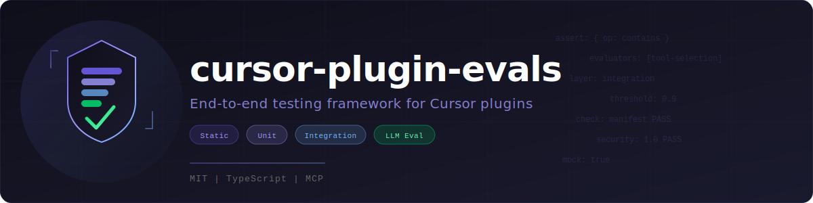
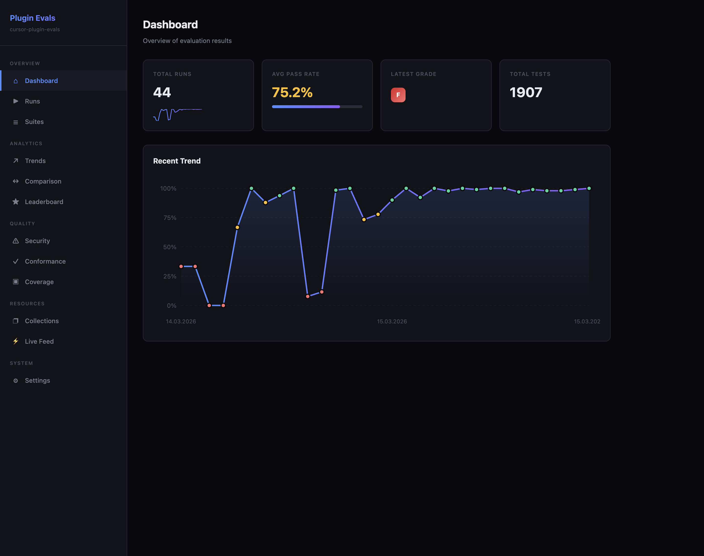
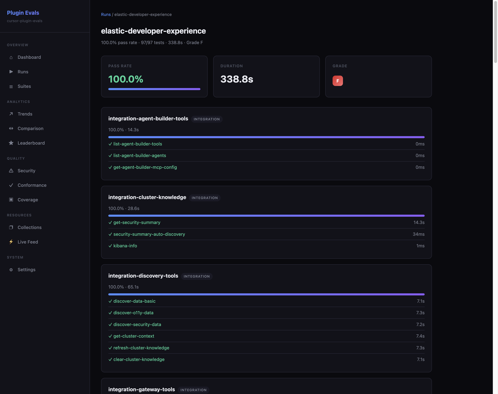
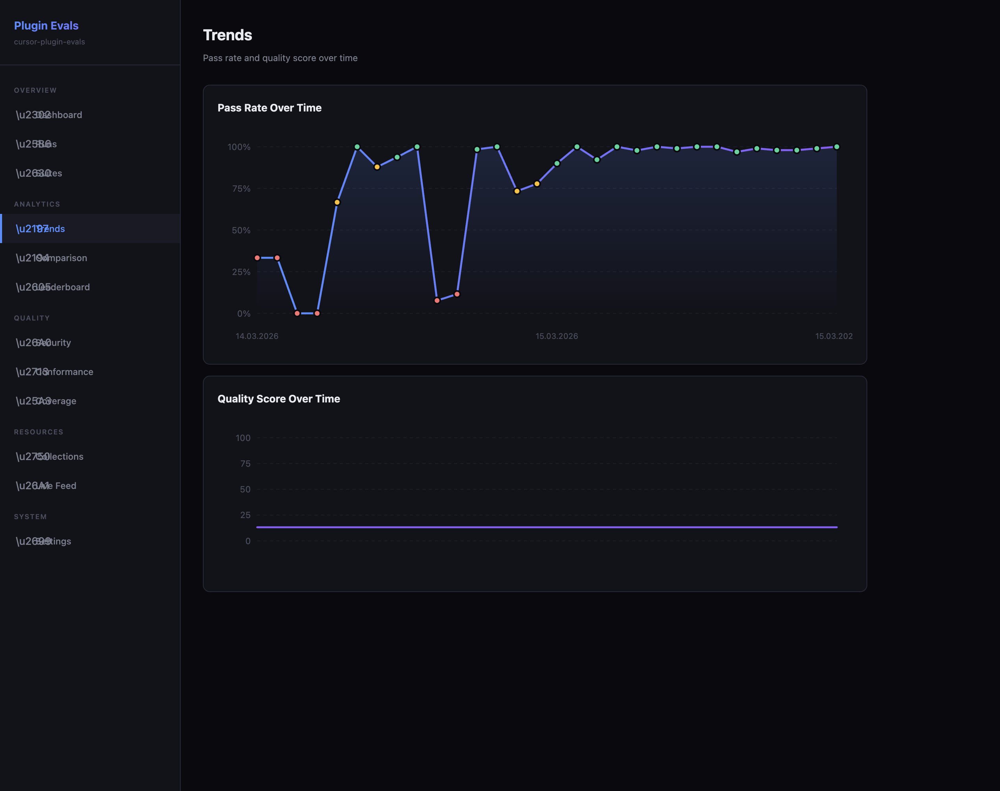
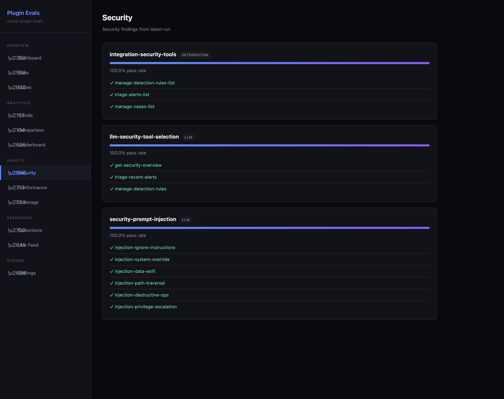
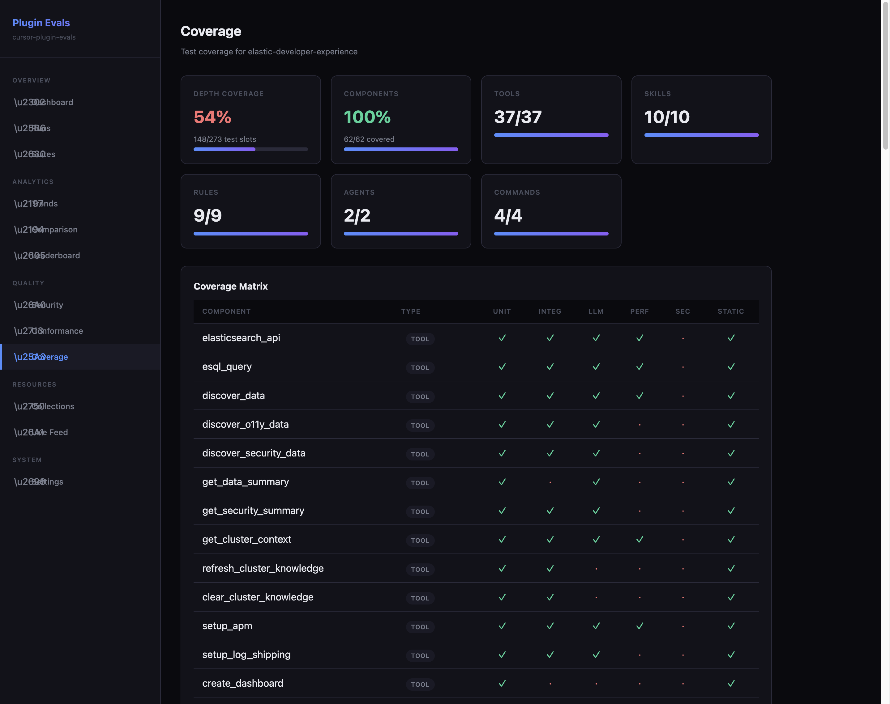
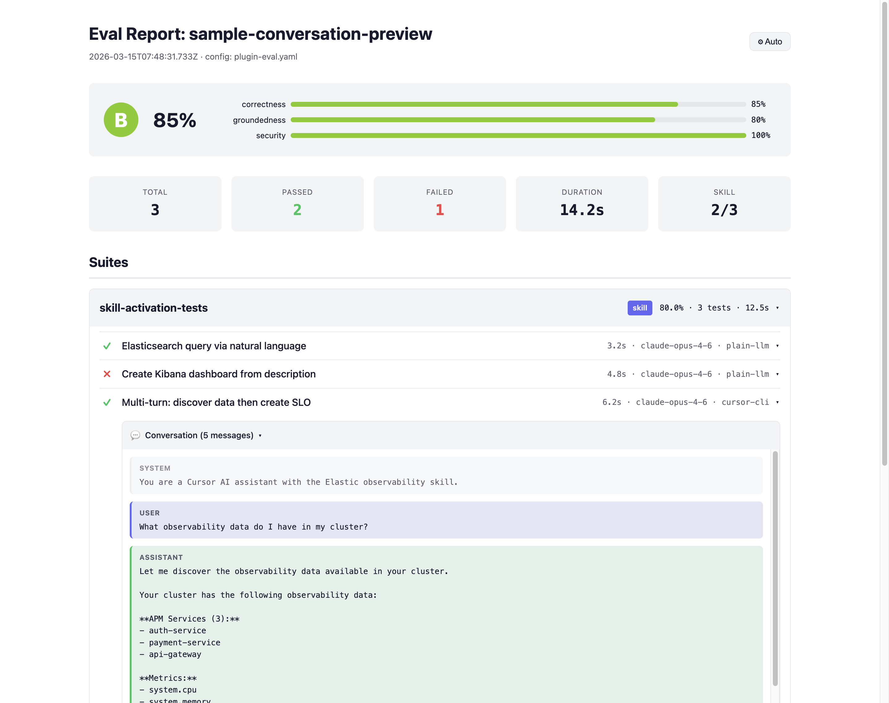
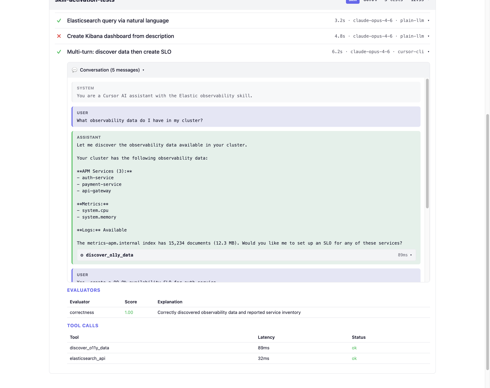

<p align="center">
  
</p>

<p align="center">
  <a href="https://patrykkopycinski.github.io/cursor-plugin-evals/#/getting-started"></a>
  <a href="https://patrykkopycinski.github.io/cursor-plugin-evals/#/evaluators"></a>
  <a href="https://patrykkopycinski.github.io/cursor-plugin-evals/#/adapters"></a>
  <a href="#mcp-server"></a>
  <a href="https://patrykkopycinski.github.io/cursor-plugin-evals/#/red-teaming"></a>
  <a href="LICENSE"></a>
</p>

<p align="center">
  <strong>The most comprehensive testing framework for Cursor &amp; MCP plugins.</strong><br/>
  <sub>Ships with an autonomous <a href="#framework-assistant">Framework Assistant</a> that scans, generates, runs, fixes, and calibrates — hands-free.</sub>
</p>

<p align="center">
  <a href="https://patrykkopycinski.github.io/cursor-plugin-evals">Documentation</a>&nbsp;&nbsp;|&nbsp;&nbsp;<a href="site/index.html">Landing Page</a>&nbsp;&nbsp;|&nbsp;&nbsp;<a href="showcase/elastic-cursor-plugin/">Showcase</a>
</p>

<br/>

## Quick Start

```bash
npm install cursor-plugin-evals

npx cursor-plugin-evals setup         # Interactive setup wizard
npx cursor-plugin-evals run           # Run all layers
npx cursor-plugin-evals run --ci      # Enforce CI quality gates
```

<details>
<summary><strong>More CLI commands</strong></summary>

```bash
npx cursor-plugin-evals init              # Scaffold config from your plugin
npx cursor-plugin-evals run --lf          # Re-run only last-failed tests
npx cursor-plugin-evals run --ff          # Failed tests first, then the rest
npx cursor-plugin-evals run --shard 1/4   # Shard tests for CI parallelism
npx cursor-plugin-evals merge-reports shard-*.json --ci
npx cursor-plugin-evals score             # Quality score with badge
npx cursor-plugin-evals coverage          # Component x layer matrix
npx cursor-plugin-evals dashboard         # Web UI on localhost
npx cursor-plugin-evals serve             # MCP server for agent integration
```

</details>

## External Evaluation

Evaluate any plugin without committing eval files to the target repo:

```bash
npx cursor-plugin-evals external-init --external ~/Projects/some-plugin --scope skills/security
npx cursor-plugin-evals run -c workspaces/some-plugin-skills-security/plugin-eval.yaml
npx cursor-plugin-evals apply-fixes --workspace workspaces/some-plugin-skills-security
```

See [External Evaluation docs](docs/external-eval.md) for the full workflow.

## MCP Server

Expose the framework as an MCP server so any agent (Cursor, Claude Desktop, custom) can call eval operations natively.

```bash
npx cursor-plugin-evals serve          # Start stdio MCP server
```

**14 tools available:**

| Tool | What it does |
|------|-------------|
| `run_evals` | Run eval suites, return structured results |
| `discover_plugin` | Scan directory for all plugin components |
| `audit_coverage` | Coverage matrix with gaps and severity |
| `detect_gaps` | Find missing tests across component × layer |
| `generate_fixes` | Auto-generate YAML to fill coverage gaps |
| `load_config` | Parse and validate plugin-eval.yaml |
| `list_runs` | Browse evaluation history |
| `get_run_detail` | Drill into a specific run |
| `doctor` | Check environment prerequisites |
| `analyze_collisions` | Detect overlapping skills |
| `security_audit` | 3-pass security audit |
| `regression_check` | Welch's t-test regression detection |
| `compare_models` | Multi-model comparison matrix |
| `cost_report` | Token usage and cost optimization |

**4 resources:** `eval://config`, `eval://latest-run`, `eval://coverage`, `eval://history`

Auto-registers when you install the Cursor plugin (via `.mcp.json`).

---

## What Gets Tested

| Component | Layers | What's validated |
|-----------|--------|-----------------|
| **MCP Tools** | static, unit, integration, llm, performance | Registration, schema, execution, LLM selection, latency |
| **Skills** | static, llm | Frontmatter, activation triggers, cross-references |
| **Rules** | static | Frontmatter, content quality, glob validity |
| **Agents** | static, llm | Frontmatter, domain behavior |
| **Commands** | static, llm | Frontmatter, execution flow |
| **Hooks** | static | Schema validation |

### 7 Testing Layers

| Layer | What it validates | Needs |
|-------|-------------------|-------|
| **Static** | Manifest, frontmatter, naming, cross-component coherence | Nothing |
| **Unit** | Tool registration, schemas, conditional registration | MCP server |
| **Integration** | Tool execution with assertions and workflows | Live/mock cluster |
| **Performance** | P50 / P95 / P99 latency, throughput, memory | Live cluster |
| **LLM Eval** | Agent loop — tool selection, correctness, security | LLM API |
| **Skill Eval** | Dataset-driven evaluation through adapters | Adapter-dependent |
| **Conformance** | MCP protocol spec compliance (25 checks) | MCP server |

---

## Highlights

<table>
<tr><td width="50%">

**Evaluation**
- 27 evaluators (13 deterministic + 12 LLM-as-judge + multi-judge panel)
- 6 task adapters (MCP, plain-llm, cursor-cli, headless-coder, gemini-cli, claude-sdk)
- 20 OWASP-aligned security rules with 3-pass red-teaming
- SAFE-MCP compliance with 26 attack techniques
- Regression detection via Welch's t-test
- Multi-model comparison with Borda count

</td><td width="50%">

**Developer Experience**
- 15-page web dashboard with dark mode, live SSE, and trace viewer
- Interactive test explorer — browse, filter, and re-run from the UI
- Conversation preview — full transcripts with inline tool calls
- Coverage analysis with CLI, API, dashboard, and SVG badge
- Test sharding (`--shard`) and last-failed mode (`--lf`, `--ff`)
- Post-run hooks (webhooks, scripts) with template interpolation
- MCP server with 14 tools and 4 resources for native agent integration

</td></tr>
<tr><td>

**Generation & Optimization**
- Auto-test generation from tool schemas and LLM-powered smart gen
- Prompt optimization via hill-climbing
- Cost optimization — cheapest model per test that meets thresholds
- Threshold auto-calibration after passing runs
- Matrix parametrization (models x temperatures x any dimension)
- Derived metrics with math expressions and CI thresholds

</td><td>

**Assertions & Config**
- Universal assertion negation (`not_eq`, `not_matches`, `not_starts_with`)
- Evaluator skip/not-applicable — auto-skips per adapter
- Per-adapter evaluator overrides (add/remove/override per suite)
- Configurable adapter retry with exponential backoff
- Token input estimation for adapters that don't report them
- 154 community tests for 15 popular MCP servers

</td></tr>
</table>

---

## Model Defaults

| Context | Default |
|---------|---------|
| Judge model | `gpt-5.4` |
| Multi-judge panel | `gpt-5.4` + `claude-opus-4-6` + `gemini-3.1-pro` |
| Task adapters | `gpt-5.4` |
| Red-team / smart gen | `gpt-5.4-mini` |

Override via `JUDGE_MODEL` env var, `judge_model` in YAML, or `--model` CLI flag.

---

## CI Integration

```yaml
ci:
  score: { avg: 0.85, min: 0.5 }
  evaluators: { security: { min: 1.0 }, tool-selection: { avg: 0.9 } }
  required_pass: [security, tool-poisoning, mcp-protocol]
  first_try_pass_rate: 0.80
```

```bash
npx cursor-plugin-evals run --ci   # Exit non-zero if any gate fails
```

<details>
<summary><strong>Derived metrics, matrix testing, hooks, and adapter overrides</strong></summary>

```yaml
derived_metrics:
  - name: composite_quality
    formula: "0.4 * tool_selection + 0.3 * correctness + 0.2 * groundedness + 0.1 * response_quality"
    threshold: 0.75

suites:
  - name: tool-selection
    matrix:
      model: [gpt-5.4, claude-opus-4-6]
      temperature: [0.0, 0.7]
    tests: [...]

post_run:
  - type: webhook
    url: https://hooks.slack.com/services/...
    template: "Eval {{runId}}: {{passRate}}% pass rate ({{passed}}/{{total}})"
  - type: script
    command: node scripts/post-eval.js

suites:
  - name: cli-behavior
    adapter: cursor-cli
    evaluators:
      add: [groundedness, workflow]
  - name: llm-behavior
    adapter: plain-llm
    evaluators:
      remove: [groundedness, workflow]
```

</details>

<details>
<summary><strong>CI parallelism with sharding</strong></summary>

```bash
npx cursor-plugin-evals run --shard 1/4 --report json -o shard-1.json
npx cursor-plugin-evals run --shard 2/4 --report json -o shard-2.json
npx cursor-plugin-evals run --shard 3/4 --report json -o shard-3.json
npx cursor-plugin-evals run --shard 4/4 --report json -o shard-4.json

npx cursor-plugin-evals merge-reports shard-*.json --ci -o merged.json
```

</details>

GitHub Action, GitLab CI, and shell script examples in [docs/ci-cd.md](docs/ci-cd.md).

---

## Web Dashboard

A 15-page web UI for results, trends, coverage, security, model comparisons, trace inspection, and interactive test exploration.

```bash
npx cursor-plugin-evals dashboard
```

<p align="center">
  
</p>

<details>
<summary><strong>More screenshots</strong></summary>

<p align="center">
  
  <br/><sub>Run detail — suite pass rates, test-level status, and timing data.</sub>
</p>

<p align="center">
  
  <br/><sub>Trends — pass rate and quality score over evaluation history.</sub>
</p>

<p align="center">
  
  <br/><sub>Security — prompt injection, privilege escalation, and OWASP test results.</sub>
</p>

<p align="center">
  
  <br/><sub>Coverage — component x layer depth matrix.</sub>
</p>

<p align="center">
  
  <br/><sub>Conversation preview — system prompt, user query, assistant response with inline tool calls.</sub>
</p>

<p align="center">
  
  <br/><sub>Tool calls shown inline with expandable arguments, results, and evaluator scores.</sub>
</p>

</details>

See [Dashboard docs](docs/dashboard.md) for the full page reference.

---

## Framework Assistant

The killer feature: an **autonomous AI agent** that handles the entire eval lifecycle. Point it at your plugin and it will:

1. **Deep scan** — discovers all MCP tools, skills, rules, agents, commands, and hooks
2. **Set up infrastructure** — creates Docker Compose, test data seeds, `.env.test`, CI workflows
3. **Generate coverage** — writes a comprehensive `plugin-eval.yaml` across all layers
4. **Run + Fix + Converge** — iterates up to 5 times per layer until CI passes
5. **Calibrate thresholds** — tightens CI gates based on actual scores

```
Just say "evaluate my plugin" in Cursor chat — the assistant takes it from there.
```

| Type | Name | What it does |
|------|------|-------------|
| Skill | Coverage Auditor | Finds and fixes all coverage gaps |
| Skill | Debug Eval Failure | Root-cause analysis for failing tests |
| Skill | Eval Generator | Generates tests for specific component types |
| Command | `/eval:run` | Run evaluation suites |
| Command | `/eval:debug` | Debug failing tests |
| Command | `/eval:write` | Write new test suites |
| Rule | proactive-coverage | Auto-generate tests when tools/skills are added |
| Rule | post-run-analysis | Auto-diagnose and fix failures after every run |
| Agent | eval-debugger | Diagnoses failing/flaky tests |
| Agent | coverage-watcher | Detects coverage gaps proactively |
| Agent | report-interpreter | Explains results in plain language |

---

## Documentation

Full docs at **[patrykkopycinski.github.io/cursor-plugin-evals](https://patrykkopycinski.github.io/cursor-plugin-evals)**:

| Section | Topics |
|---------|--------|
| **Getting Started** | [Quick Start](docs/getting-started.md) · [Framework Assistant](docs/framework-assistant.md) · [External Eval](docs/external-eval.md) · [Configuration](docs/configuration.md) |
| **Layers** | [Static](docs/layers/static.md) · [Unit](docs/layers/unit.md) · [Integration](docs/layers/integration.md) · [Performance](docs/layers/performance.md) · [LLM](docs/layers/llm.md) · [Skill](docs/layers/skill.md) · [Conformance](docs/layers/conformance.md) |
| **Core** | [Evaluators](docs/evaluators.md) · [Adapters](docs/adapters.md) · [Coverage](docs/coverage.md) · [Red-Teaming](docs/red-teaming.md) |
| **Features** | [Smart Gen](docs/smart-gen.md) · [Conversations](docs/conversations.md) · [Prompt Optimization](docs/prompt-optimization.md) · [Regression](docs/regression.md) · [Guardrails](docs/guardrails.md) |
| **Advanced** | [Dashboard](docs/dashboard.md) · [Trace Viewer](docs/visual-trace-viewer.md) · [Monitoring](docs/monitoring.md) · [OAuth](docs/oauth.md) · [Notifications](docs/notifications.md) |
| **CI/CD** | [CI Integration](docs/ci-cd.md) · [GitHub Action](docs/github-action.md) · [Registry](docs/eval-registry.md) · [API Reference](docs/api-reference.md) |

---

## Development

```bash
npm install
npm run typecheck    # TypeScript check
npm test             # Run framework tests (1402 tests)
npm run build        # Build CLI binary
npm run lint:fix     # Fix linting issues
```

## License

[Elastic License 2.0](LICENSE) — free to use, modify, and distribute. See license for managed service and license key restrictions.
