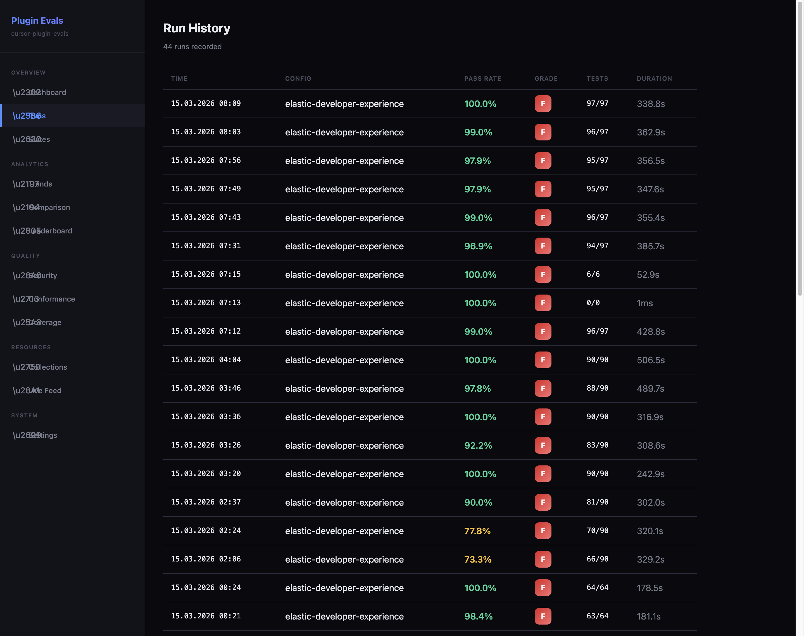
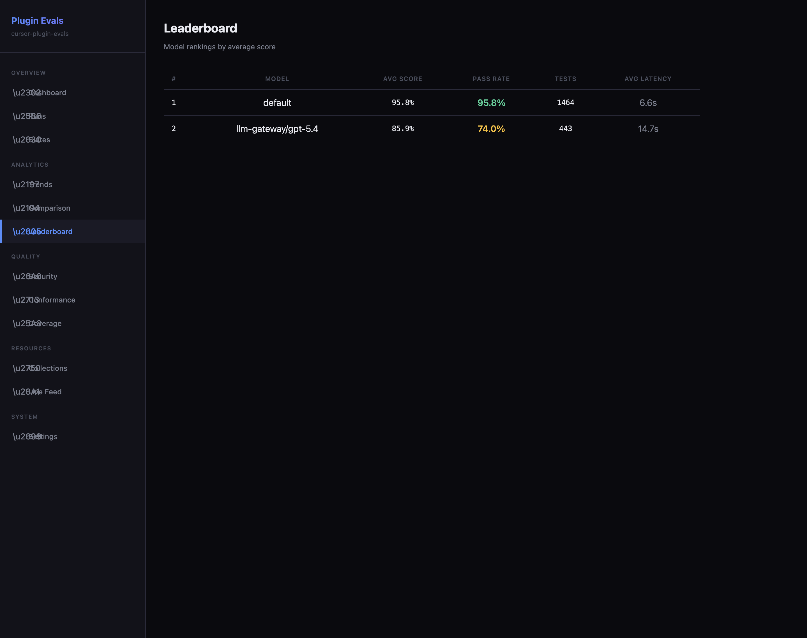

# Web Dashboard

The `cursor-plugin-evals` framework ships with a built-in web dashboard — a 13-page UI that provides real-time visibility into evaluation results, trends, coverage, security findings, and more.

## Quick Start

```bash
# Start the dashboard
npx cursor-plugin-evals dashboard

# Custom port
npx cursor-plugin-evals dashboard --port 8080

# Skip opening browser
npx cursor-plugin-evals dashboard --no-open
```

The dashboard opens automatically in your default browser. Data is populated when you run evals — there is no separate import step.

## Storage

Dashboard data is stored in `.cursor-plugin-evals/dashboard.db` (SQLite). This file is created automatically on first run and updated after each eval execution. You can delete it to reset all historical data.

---

## Pages

The dashboard is organized into five sections accessible from the sidebar navigation.

### Overview

#### Dashboard

The main landing page. Displays stat cards for total runs, average pass rate, latest grade, and total tests executed. A sparkline and trend chart show how quality has changed over time.


*The overview page provides an at-a-glance summary of your plugin's evaluation health.*

#### Runs

A table of all evaluation runs ordered by time. Each row shows the run timestamp, configuration used, pass rate, grade, test count, and duration. Click any row to drill down into the run detail view.



*The runs page lets you browse historical evaluations and spot regressions quickly.*

#### Run Detail

Drilling into a specific run reveals a suite-level breakdown with individual test results. Each suite shows its pass rate, and you can expand it to see every test case with its status, score, and failure details.


*The run detail page gives full visibility into what passed, what failed, and why.*

#### Suites

Displays suite performance across all runs. Shows average and latest pass rates per suite, making it easy to identify consistently underperforming test groups.

### Analytics

#### Trends

Line charts plotting pass rate and quality score over time. Useful for tracking whether your plugin is improving or regressing as you iterate.


*The trends page reveals long-term quality trajectories across your evaluation history.*

#### Comparison

Side-by-side model comparison from the latest run. Compares pass rate, average score, and latency across all models tested, helping you choose the best model for your plugin.

#### Leaderboard

Rankings of models by average score across all historical runs. The leaderboard highlights which models consistently perform best with your plugin's tools and skills.



*The leaderboard ranks models by their cumulative performance across all evaluation runs.*

### Quality

#### Security

Security findings from the latest evaluation run. Lists suites that include security tests along with their pass rates, and surfaces individual test results so you can identify and address vulnerabilities.


*The security page highlights prompt injection, privilege escalation, and other security test outcomes.*

#### Conformance

Displays the conformance tier your plugin achieved and detailed conformance results. Conformance tiers indicate how well your plugin adheres to framework standards and best practices.

#### Coverage

A matrix view showing which test layers (unit, integration, LLM, performance, static, security) cover each plugin component (tools, skills, rules, agents, commands). Gaps are immediately visible.


*The coverage matrix makes it easy to spot untested components and missing test layers.*

### Resources

#### Collections

Lists all available test collections grouped by layer (static, unit, integration, LLM, performance, security). Useful for understanding what tests exist and planning coverage improvements.

#### Live Feed

A real-time stream of evaluation events delivered via Server-Sent Events (SSE). Shows test starts, completions, failures, and suite progress as evals execute. Useful for monitoring long-running evaluation suites.

### System

#### Settings

Configuration options for the dashboard itself:

- **Theme** — Toggle between dark and light mode. The preference is persisted in the browser.
- **Cache** — Clear the dashboard cache to force a full reload of data from the SQLite database.

---

## Technical Details

| Component | Technology |
|---|---|
| Web framework | Hono (lightweight, fast) |
| Storage | SQLite via better-sqlite3 |
| Real-time events | Server-Sent Events (SSE) |
| Theming | Dark/light mode with CSS variables |
| Layout | Responsive with mobile sidebar toggle |
| Runtime dependencies | None — all CSS and JS are inline |

The dashboard is entirely self-contained. It does not fetch external stylesheets, scripts, or fonts at runtime. This means it works in air-gapped environments and behind corporate proxies without additional configuration.
